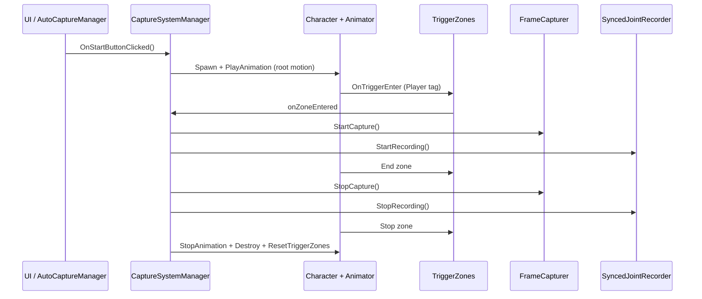

# Architecture / アーキテクチャ

## English

### High-level flow

### Output locations

- **Default root:** `{ProjectRoot}/Output/` — override with **`CaptureSystemManager.captureOutputRootPath`** (relative to project root or absolute).
- **`{root}/<folderName>/`**
  - `frame_0000.jpg`, … — from `FrameCapturer`
  - `synced_joint_positions_<timestamp>.csv` — from `SyncedJointRecorder`
- **Folder name:** `CaptureSystemManager` sets `CapturedFrames_<camX>_<camY>_<camZ>` from the capture camera position (1 decimal) unless overridden.

### Trigger zones

| Role | Typical use |
|------|-------------|
| Capture start | Begin frame + joint recording |
| Capture end | Stop recording, validate sync |
| Stop | Halt animation, destroy character, reset triggers |

All expect **`Player`** tag on the entering collider’s GameObject.

### Auto batch capture

`AutoCaptureManager` moves `captureCamera`, waits briefly, then calls `CaptureSystemManager.OnStartButtonClicked()` and **waits until `IsRunning()` is false**. CSV format: see [SETUP_AND_USAGE.md](SETUP_AND_USAGE.md).

---

## 日本語

### 処理の流れ（要約）

1. **開始:** `CaptureSystemManager` がキャラクター生成とアニメーション再生を開始（Root Motion で移動）。
2. **撮影開始ゾーン:** `FrameCapturer` と `SyncedJointRecorder` が同時に開始。
3. **撮影終了ゾーン:** 両方停止し、必要なら同期検証。
4. **全停止ゾーン:** アニメ停止・キャラ破棄・トリガーリセット。

### 出力パス

- 既定ルートは **`Output/`**（`Assets` と並ぶ）。**`captureOutputRootPath`** で別フォルダ（相対・絶対）に変更可。
- 画像は **JPG**（連番 `frame_XXXX.jpg`）。関節CSVは同じルート配下のサブフォルダ。
- 生成物は **`.gitignore`** で除外しやすいよう、リポジトリ外の絶対パスを指定する運用も可。

### タグ

トリガーは **`Player`** タグのみ反応。`CaptureSystemManager` が生成時にタグを付与します。

### 自動複数視点

`AutoCaptureManager` が CSV の各視点でカメラを動かし、都度 `CaptureSystemManager` に1ラン分を依頼します。
